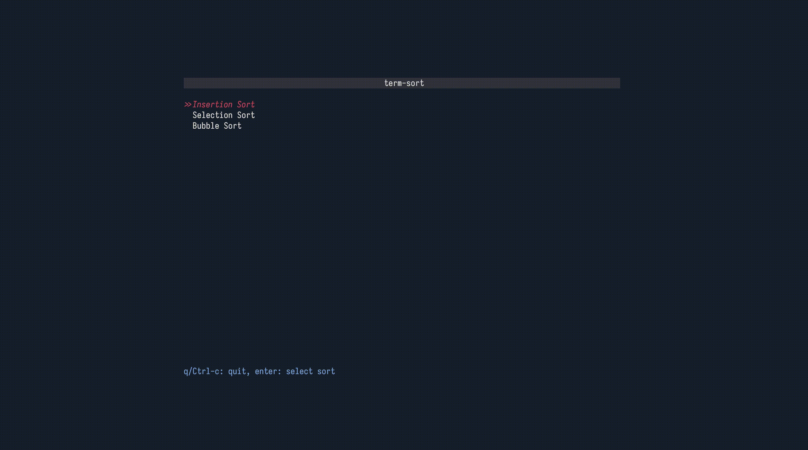

# term-sort
Visualize sorting algorithms in your terminal.

[](https://opensource.org/licenses/MIT)


## About
`term-sort` is a TUI application that provides some basic visualizations for various sorting algorithms. 

## Install & Usage
Install `term-sort` with [cargo](https://github.com/rust-lang/cargo):

```
$ cargo install term-sort
```

Start the visualization tool by running `term-sort` - No flags are currently supported for the application.
```
$ term-sort
```
